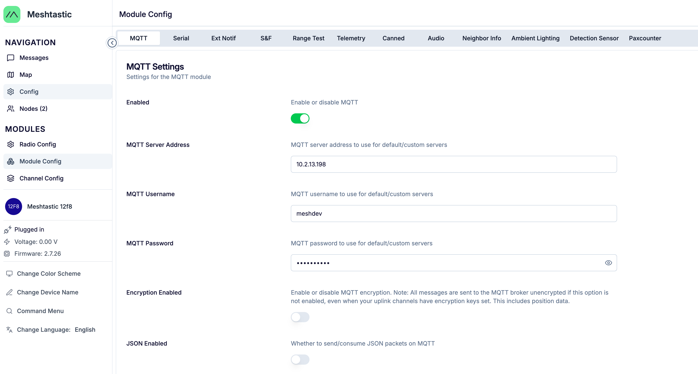
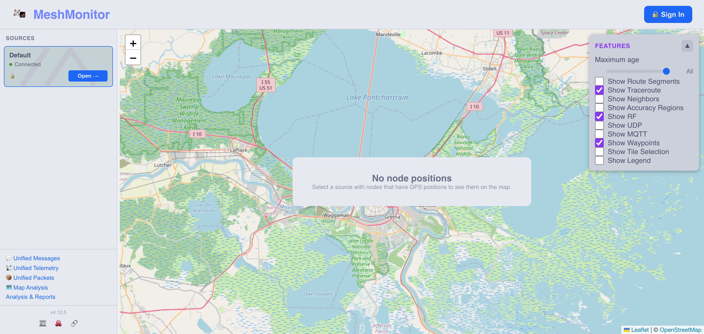
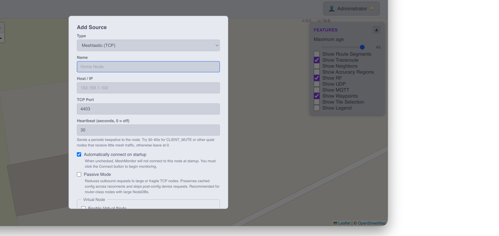
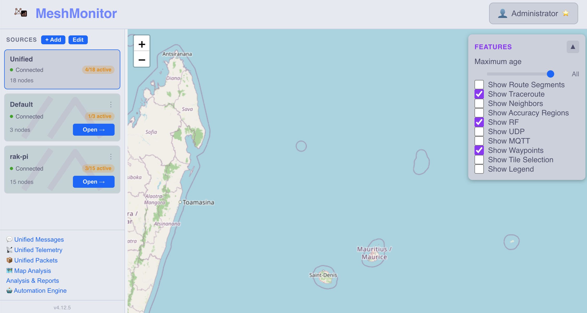
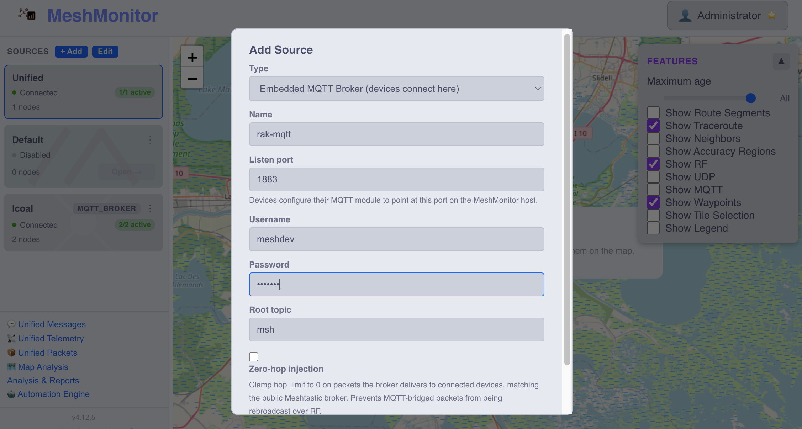
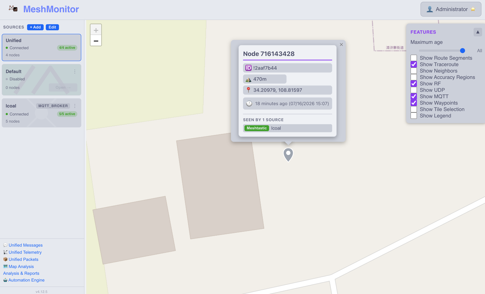
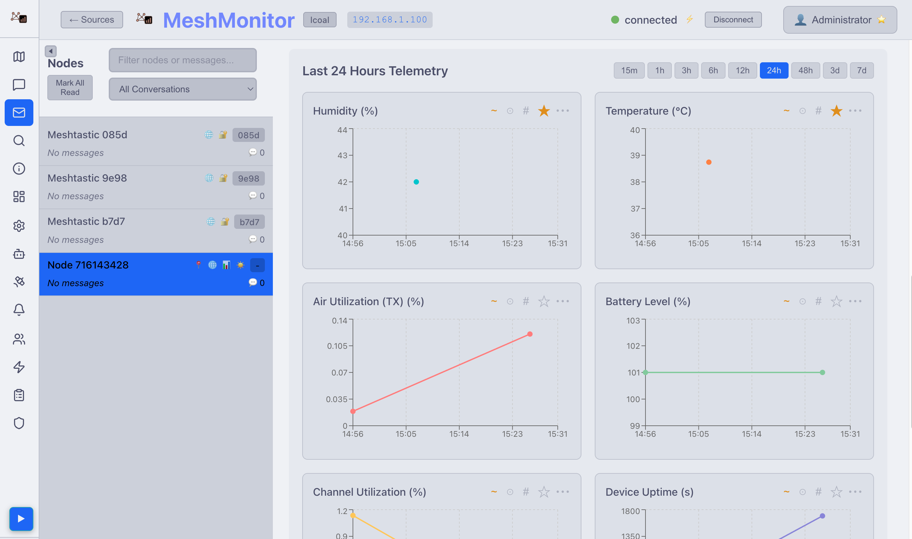

# RAK6421 WisMesh Pi HAT MeshMonitor Guide

Use this guide to view telemetry from a RAK6421 WisMesh Pi HAT in MeshMonitor. It is for a Raspberry Pi running `meshtasticd` with a RAK13300 or RAK13302 LoRa module, environmental sensors, and an optional RAK12501 GPS.

The firmware image includes the two files used below:

```text
/home/rak/meshmonitor/setup.sh
/home/rak/meshmonitor/meshmonitor-docker-compose.yaml
```

This guide supports two connection types, you can choose either one:

- **TCP**: MeshMonitor reads data directly from `meshtasticd`. This is the recommended first setup.
- **MQTT**: `meshtasticd` publishes data to MeshMonitor's embedded MQTT broker.

For either connection type, MeshMonitor can run on the Raspberry Pi or on another computer in the same LAN.

For a first installation, start with TCP. It is the simplest option and shows the most complete RAKwireless WisMesh Station information in MeshMonitor.

## Before You Start

Install the RAK6421 Meshtastic firmware release:

<https://github.com/RAKWireless/meshtastic-rak6421-guide/releases/tag/2.7.26>

You need:

- Raspberry Pi 4/5 with RAK6421 WisMesh Pi HAT.
- RAK13300 or RAK13302.
- Optional environmental sensor and RAK12501 GPS.
- A network connection for the Pi.
- Docker and Docker Compose on the computer that will run MeshMonitor. On a
  Mac or Windows PC, install and start Docker Desktop first.

Default credentials on the reference image（for RAKPiOS, you will be forced to change this password after the first login）:

```text
Pi SSH: rak / changeme
MeshMonitor: admin / changeme
```

## Choose Your Setup

Choose one connection type, then choose where MeshMonitor will run.

| Connection | Best For | MeshMonitor Source |
| ---------- | -------- | ------------------ |
| TCP | First setup and full node information. | `Meshtastic (TCP)` |
| MQTT | A broker-based deployment after TCP works. | `Embedded MQTT Broker (devices connect here)` |

| MeshMonitor Location | What It Means |
| -------------------- | ------------- |
| This Raspberry Pi | Docker, MeshMonitor, and `meshtasticd` run on one Pi. |
| Another LAN computer | `meshtasticd` stays on the Pi; Docker and MeshMonitor run on a Mac, PC, or server. |

You can use a CLI-like way to easily choose the connection type and MeshMonitor location with command-line options:

```bash
# TCP, MeshMonitor on this Pi
sudo ./setup.sh --mode tcp --meshmonitor-host local --non-interactive

# TCP, MeshMonitor on another LAN computer
sudo ./setup.sh --mode tcp --meshmonitor-host <meshmonitor-host-ip> --non-interactive

# MQTT, MeshMonitor on this Pi
sudo ./setup.sh --mode mqtt --meshmonitor-host local --non-interactive

# MQTT, MeshMonitor on another LAN computer
sudo ./setup.sh --mode mqtt --meshmonitor-host <meshmonitor-host-ip> --non-interactive
```

You can also run `sudo ./setup.sh` without arguments, and set it up in an interactive way. The script asks two questions and offers TCP with MeshMonitor on this Pi as the default. Press Enter to accept a default choice.

## Step 1: Prepare The Raspberry Pi

Find the Pi IP address and connect to the Pi:

```bash
ssh rak@<pi-ip>
```

Run the guided setup:

```bash
cd /home/rak/meshmonitor
sudo chmod +x ./setup.sh
sudo ./setup.sh
```

The script:

- Checks and starts `meshtasticd`.
- Enables UART and I2C for the Pi HAT.
- Enables the `meshtasticd` web portal on port `9443`.
- Enables device and environmental telemetry.
- Enables GPS for RAK12501 and disables smart position broadcast.
- Applies the selected TCP or MQTT profile.
- Creates `meshmonitor.env`. This file gives MeshMonitor the Pi IP address for
  the automatic TCP Source described in [Step 3](#step-3-check-or-add-a-meshmonitor-source).


For MQTT, the script uses Meshtastic's default MQTT values, except for the
broker address. It configures direct publishing to:

```text
Broker: <meshmonitor-host-ip>:1883
Username: meshdev
Password: large4cats
Root topic: msh
```

To use custom MQTT credentials, you can either change it in the Meshtastic's web portal at https://<pi-ip>:9443(as shown below).



or you can pass the value to the setup script as auguments, then use the same values when you create the MQTT source in MeshMonitor later:

```bash
sudo ./setup.sh --mode mqtt \
  --meshmonitor-host <meshmonitor-host-ip> \
  --mqtt-username <username> \
  --mqtt-password <password> \
  --mqtt-root <root-topic> \
  --non-interactive
```

If the script asks you to reboot, do so:

```bash
sudo reboot
```

After rebooting, open the Pi web portal:

```text
https://<pi-ip>:9443
```

## Step 2: Start MeshMonitor

### Run MeshMonitor On The Pi

On the Pi:

```bash
cd /home/rak/meshmonitor
docker compose -f meshmonitor-docker-compose.yaml up -d
docker compose -f meshmonitor-docker-compose.yaml ps
```

Open:

```text
http://<pi-ip>:8080
```

### Run MeshMonitor On Another LAN Computer

Copy both MeshMonitor files from the Pi to the computer that will run MeshMonitor. The second file contains the automatically generated TCP settings.

```bash
mkdir -p ~/meshmonitor
scp rak@<pi-ip>:/home/rak/meshmonitor/meshmonitor-docker-compose.yaml ~/meshmonitor/
scp rak@<pi-ip>:/home/rak/meshmonitor/meshmonitor.env ~/meshmonitor/
cd ~/meshmonitor
```

Start MeshMonitor on that computer:

```bash
docker compose -f meshmonitor-docker-compose.yaml up -d
docker compose -f meshmonitor-docker-compose.yaml ps
```

Keep `meshmonitor-docker-compose.yaml` and `meshmonitor.env` in the same folder. Docker Compose reads both files when it starts the container.

Open MeshMonitor locally:

```text
http://127.0.0.1:8080
```

The compose file exposes:

```text
MeshMonitor web UI: 8080
Embedded MQTT broker: 1883
```

Log in with:

```text
Username: admin
Password: changeme
```

> **NOTE**
>
> The included compose file uses `ALLOWED_ORIGINS=*` for local testing. Set a specific browser origin before exposing MeshMonitor outside your LAN. See [MeshMonitor's access guide](https://meshmonitor.org/getting-started.html#accessing-from-different-devices-ips) for details.

## Step 3: Check Or Add A MeshMonitor Source

Open **Sources** in MeshMonitor after signing in. What you do next depends on the mode selected in `setup.sh`.

### TCP: Source Is Added Automatically

When you use TCP, `setup.sh` creates `meshmonitor.env`. On MeshMonitor's first start, before it has any saved data, it uses this file to create a `Meshtastic (TCP)` source for `<pi-ip>:4403`. Confirm that the source appears and is connected.



If your MeshMonitor already has saved data from an earlier installation, but you still need to add some new TCP source, you can add it manually:

1. Log in MeshMonitor use **admin / changeme** 
2. Select **Add Source**.
3. Select **Meshtastic (TCP)**.
4. Enter a name, such as `rak-pi`.
5. Set:

```text
Host: <pi-ip>
Port: 4403
```

5. Select **Save**.

   

6. You should see the new source is added, you can select **Open** to see more details.TCP normally provides the richest node information.



### MQTT Source

Use this only after running the MQTT profile in `setup.sh`.

1. Select **Add Source**.
2. Select **Embedded MQTT Broker (devices connect here)**.
3. Enter a name, such as `rak-mqtt`.
4. Set the values to match `setup.sh`:

```text
Listener port: 1883
Username: meshdev
Password: large4cats
Root topic: msh
```

5. Select **Save**.
6. Wait for the Pi to reconnect and publish.



An embedded MQTT broker is a listener. It may not have the same **Open** button as a TCP source. Do not use `MeshCore` for this setup. `MQTT Bridge` is for forwarding to a separate upstream broker and is not needed for this basic guide.

## Step 4: View Telemetry

Open **Unified Telemetry**:

```text
http://<meshmonitor-host>:8080/unified/telemetry
```

For a Pi-local installation, `<meshmonitor-host>` is `<pi-ip>`. For a LAN-hosted installation, use the LAN IP of the computer running MeshMonitor, or `127.0.0.1` when viewing it locally.

You should see device telemetry such as battery, uptime, temperature, and environmental sensor values after the node sends a report.

## GPS And Map

The setup script enables RAK12501 GPS when the module is installed. Move the antenna where it has a clear view of the sky, then confirm that Meshtastic has a position. Run this command on the Pi:

```bash
rak@rakpios:~ $ meshtastic --info
No Serial Meshtastic device detected, attempting TCP connection on localhost.
Connected to radio

Owner: Meshtastic 12f8 (12f8)
My info: { "myNodeNum": 716143428, "minAppVersion": 30200, "deviceId": "pBw7rsOrW5K6y6rf2dAoTA==", "pioEnv": "native-tft", "nodedbCount": 4, "rebootCount": 0, "firmwareEdition": "VANILLA" }
Metadata: { "firmwareVersion": "2.7.26", "deviceStateVersion": 24, "hasWifi": true, "positionFlags": 811, "hwModel": "RAK6421", "hasPKC": true, "excludedModules": 13568, "canShutdown": false, "hasBluetooth": false, "hasEthernet": false, "role": "CLIENT", "hasRemoteHardware": false }

Nodes in mesh: {
  "!2aaf7b44": {
    "num": 716143428,
    "user": {
      "id": "!2aaf7b44",
      "longName": "Meshtastic 12f8",
      "shortName": "12f8",
      "macaddr": "32:02:3f:54:38:59",
      "hwModel": "RAK6421",
      "publicKey": "+GTW/FtxnaHy9DN54dyOqqX36nVx9Q8D5lnJDQKiYSk=",
      "isUnmessagable": false
    },
    "position": {
      "latitudeI": 342115131,
      "longitudeI": 1088359790,
      "altitude": 450,
      "time": 1784186080,
      "locationSource": "LOC_INTERNAL",
      "latitude": 34.2115131,
      "longitude": 108.835979
    },
    ...
  },
```

Then check for latitude and longitude in the map with the "show MQTT"  options in the map lengend enabled. A valid position in the CLI does not always produce a marker on the MeshMonitor map: the map needs a position packet that MeshMonitor receives and recognizes.





## Troubleshooting

### MeshMonitor Does Not Open

Run this on the computer hosting MeshMonitor:

```bash
docker compose -f meshmonitor-docker-compose.yaml ps
docker compose -f meshmonitor-docker-compose.yaml logs meshmonitor --tail 100
```

### TCP Source Does Not Connect

Run this on the Pi:

```bash
systemctl status meshtasticd.service --no-pager
meshtastic --info
nc -vz <pi-ip> 4403
```

Make sure the TCP source uses the Pi IP, not `127.0.0.1`.

### MQTT Data Does Not Arrive

Confirm that the MQTT profile points to the correct MeshMonitor host:

```bash
meshtastic --get mqtt.enabled \
  --get mqtt.address \
  --get mqtt.username \
  --get mqtt.root
```

On the MeshMonitor host, inspect MQTT traffic:

```bash
mosquitto_sub -h 127.0.0.1 -p 1883 \
  -u meshdev -P large4cats \
  -t 'msh/#' -v
```

Restart `meshtasticd` after correcting settings:

```bash
sudo systemctl restart meshtasticd.service
```

### Telemetry Takes Time To Appear

Environmental telemetry is configured to report every 1800 seconds (30 minutes). Restarting `meshtasticd` can help produce fresh data during a test, but it does not guarantee an immediate environmental report:

```bash
sudo systemctl restart meshtasticd.service
```

## Advanced Use

### Switch Between TCP And MQTT

Run `setup.sh` again with the new mode. TCP disables direct MQTT publishing; MQTT enables it and points the Pi at the host you provide.

```bash
sudo ./setup.sh --mode tcp --meshmonitor-host local --non-interactive
sudo ./setup.sh --mode mqtt --meshmonitor-host <meshmonitor-host-ip> --non-interactive
```

For a completely clean comparison, remove MeshMonitor's saved sources and telemetry first:

```bash
docker compose -f meshmonitor-docker-compose.yaml down -v
docker volume rm meshmonitor_meshmonitor-data
docker compose -f meshmonitor-docker-compose.yaml up -d
```

## References

- RAK6421 firmware release:
  <https://github.com/RAKWireless/meshtastic-rak6421-guide/releases/tag/2.7.26>
- MeshMonitor MQTT broker documentation:
  <https://meshmonitor.org/features/mqtt-broker.html>
